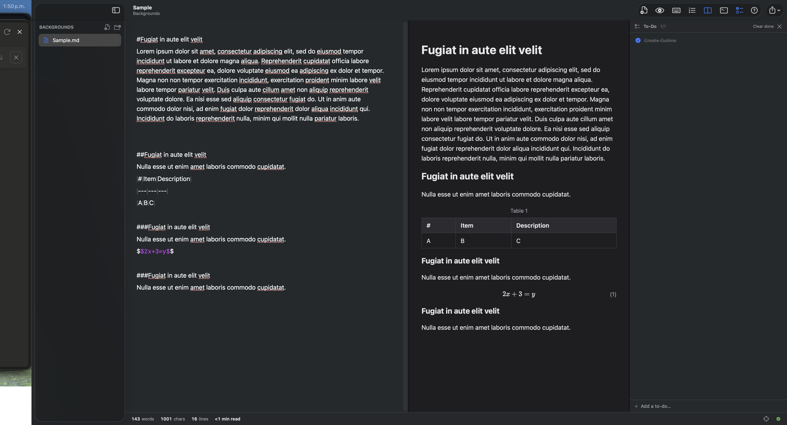
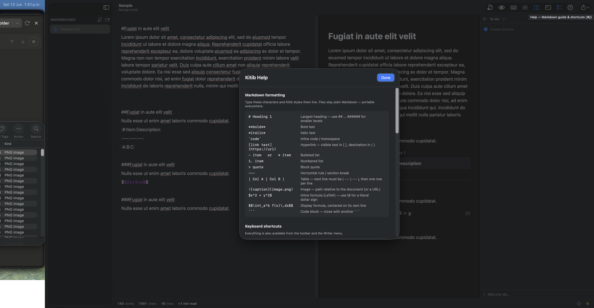
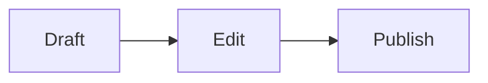

[Contributors](https://github.com/kitibstudio/kitibrepo/graphs/contributors)
[Forks](https://github.com/kitibstudio/kitibrepo/network/members)
[Stargazers](https://github.com/kitibstudio/kitibrepo/stargazers)
[Issues](https://github.com/kitibstudio/kitibrepo/issues)
[MIT License](https://github.com/kitibstudio/kitibrepo/blob/main/LICENSE)

### Kitib (كاتب)

A focused, minimalist native writing app for professionals: Markdown with live styling, on macOS, iPadOS and iOS.
**[Explore the docs »](#usage)**
[Report Bug](https://github.com/kitibstudio/kitibrepo/issues/new?labels=bug) · [Request Feature](https://github.com/kitibstudio/kitibrepo/issues/new?labels=enhancement)

Table of Contents

1. [About The Project](#about-the-project)
  - [Built With](#built-with)
2. [Getting Started](#getting-started)
  - [Prerequisites](#prerequisites)
  - [Installation](#installation)
3. [Usage](#usage)
4. [Roadmap](#roadmap)
5. [Contributing](#contributing)
6. [License](#license)
7. [Contact](#contact)
8. [Acknowledgments](#acknowledgments)

## About The Project



**Kitib** is a lightweight, native writing app for professionals who want their tools out of the way. It is a Markdown editor with live styling, so your files stay plain, portable Markdown while the app handles the look as you type. Everything beyond the page; preview, stats, export, terminal; stays hidden until you reach for it.

*Live-styled Markdown on the left, fully rendered preview (tables, KaTeX math, Mermaid diagrams, headings) on the right, with a per-document to-do panel.*

The name comes from the Arabic كاتب (*kātib*), "one who writes," from the root ك-ت-ب (*k-t-b*), "to write"; the same root behind *kitāb* (book), *maktaba* (library), and *kitāba* (writing itself).

Highlights:

- **Markdown editor with live styling**; type Markdown, see it styled inline; files stay portable plain text.
- **One codebase, three platforms**; macOS 13+, iPadOS 16+ and iOS 16+. The same documents, the same editor, everywhere.
- **VS Code-style file explorer**; open any folder; the sidebar lists its `.md`, `.markdown`, `.txt` and `.text` files with rename, duplicate, new file/folder, reveal, and trash.
- **Split-screen rendered preview**; synced scrolling with tables, images, KaTeX math, and Mermaid diagrams.
- **Diagrams**; write a ` ```mermaid ` code block and it renders as a flowchart, sequence, class, state, ER, Gantt, or pie chart, live in the preview and in exports.
- **Fully offline**; math and diagrams render from libraries bundled inside the app; no network connection is ever required.
- **YAML front matter**; add a `---` metadata block at the top of a document; it is hidden from the rendered preview and exports by default, with independent toggles to show it in each.
- **Integrated terminal**; a real shell panel below the writing area on macOS (powered by SwiftTerm).
- **Per-document to-do lists**, focus mode, typewriter scrolling, templates, word goals, line numbers, and light/dark mode.
- **Fully rendered export**; Print, PDF, HTML, and Copy as Rich Text for pasting into LinkedIn or email.
- **Autosave** as you type, and a built-in Markdown + shortcuts help guide.

### Built With

- [Swift](https://swift.org/) and [SwiftUI](https://developer.apple.com/xcode/swiftui/), with AppKit and UIKit where the platform calls for it
- [SwiftTerm](https://github.com/migueldeicaza/SwiftTerm); vendored terminal emulator (MIT)
- [KaTeX](https://katex.org); math rendering, bundled for offline use (MIT)
- [Mermaid](https://mermaid.js.org); diagram rendering, bundled for offline use (MIT)

([back to top](#readme-top))

## Getting Started

Kitib is a standard Xcode project, generated with [XcodeGen](https://github.com/yonaskolb/XcodeGen) from `project.yml`.

### Prerequisites

- macOS 13 (Ventura) or later to build and run the macOS app
- Xcode 14 or later (for iOS/iPadOS builds, Xcode with the iOS 16 SDK)
- [XcodeGen](https://github.com/yonaskolb/XcodeGen) only if you regenerate the project: `brew install xcodegen`

### Installation

1. Get a local copy of the project.
  ```sh
  git clone https://github.com/kitibstudio/kitibrepo.git
  cd kitibrepo
  ```
2. Regenerate the Xcode project (only needed if `project.yml` changed; a ready-made `Kitib.xcodeproj` is committed).
  ```sh
  xcodegen generate
  ```
3. Open and run.
  ```sh
  open Kitib.xcodeproj
  ```
4. Select the **Kitib-macOS** scheme (or **Kitib-iOS** with an iPhone/iPad simulator) and hit Run.

First launch: if macOS warns about an unidentified developer, right-click **Kitib.app → Open**.

([back to top](#readme-top))

## Usage

**Files**; open any folder (⌘O); the sidebar shows its Markdown and text files like VS Code. Right-click for rename, duplicate, new file/folder, reveal in Finder, or move to trash. Everything autosaves as you type.

**Writing**; ⌘N for a new document, or use the template button (toolbar) for Report, Article, Design Note, Blog Post, or LinkedIn Post starting points; each with a suggested word goal. A blank document is always one keystroke away.

**Writer menu / toolbar**

| Tool                                            | Shortcut |
| ----------------------------------------------- | -------- |
| New Document                                    | ⌘N       |
| Open Folder…                                    | ⌘O       |
| Save (manual; autosave is on)                   | ⌘S       |
| Find… / Find and Replace…                       | ⌘F / ⌥⌘F |
| Find Next / Previous / Use Selection            | ⌘G / ⇧⌘G / ⌘E |
| Focus mode (dims all but current paragraph)     | ⌘⇧F      |
| Typewriter scrolling (caret stays centered)     | ⌘⇧T      |
| Line numbers                                    | ⌘⇧L      |
| Split preview (rendered view, synced scrolling) | ⌘⇧P      |
| Show front matter in preview                    | ⌘⇧Y      |
| Integrated terminal below the writing area      | ⌃`       |
| To-do list panel (per document)                 | ⌘⇧D      |
| Outline panel (headings + section reorder)      | ⌘⇧O      |
| Bigger / smaller text                           | ⌘+ / ⌘−  |
| Print (with optional line numbers)              | ⌘P       |
| Help (Markdown guide & shortcuts)               | ⌘/       |

**Appearance**; Writer menu → Appearance: System, Light, or Dark.

**Stats bar**; live word, character, and line counts plus reading time. Click the target icon to set a word goal; progress shows per document, and hitting the goal earns fireworks (toggleable).

**Terminal**; ⌃` (or the toolbar terminal button) opens a lightweight shell panel below the writing area on macOS. Right-click any folder in the sidebar → "Open in Terminal" to start it there. Drag the divider to resize.

**Outline**; ⌘⇧O opens the heading outline: click to jump, drag to move a section and everything nested under it. Reorder is validated against the document structure, and the editor scrolls to wherever you land.

**Smart folders**; save a search as a folder: the sidebar's SMART FOLDERS section runs full-text queries over the open vault (FTS5) and lists ranked results. Rename, edit, or delete them anytime.

**Tables**; with the cursor in a Markdown pipe table, the toolbar's grid button opens an editable spreadsheet-style view: type in cells, add/remove rows and columns, reorder with the row/column menus, and the table text updates on close.

**Paste healing**; paste text from a PDF, Word, or a web page and Kitib offers a preview of the cleaned-up result: page furniture stripped, hard-wrapped paragraphs rejoined, broken hyphenation repaired, smart quotes and ligatures normalised, whitespace tables turned into real Markdown tables, clause numbers protected from list rendering. Accept or reject with one click.

**Front matter**; start a document with a YAML metadata block fenced by `---`:

```
---
title: Anatomy of a Design Note
status: draft
tags: design-note, documentation
---
```

It stays in the saved `.md` file (portable to Jekyll, Hugo, Pandoc, Obsidian, etc.) but is **hidden by default** in the rendered preview and in print/PDF/HTML export, so it never clutters the page. Two independent toggles control it, both off by default: Writer menu → **Show Front Matter in Preview** (⌘⇧Y) renders it as a clean metadata table in the preview pane, and **Include Front Matter in Print / Export** (Writer menu, or the toolbar share menu) adds it to exports. In the editor it is always visible as plain text. The **Design Note** template ships with a ready-to-fill set of fields.

**Wiki links**; `[[Target Document]]` resolves by title, alias, or filename to files in the vault.

**Export**; the share button in the toolbar: HTML, PDF (honors the line-number setting), or Copy as Rich Text for pasting into LinkedIn / email. Figures, tables and equations can be numbered automatically (Writer menu → Number Figures, Tables & Equations).

**Help**; the ?-button in the toolbar (or ⌘/) opens a searchable guide to Markdown formatting and all keyboard shortcuts.



*The built-in help (⌘/) lists every Markdown rule and keyboard shortcut without leaving the app.*

**Diagrams**; write a fenced code block tagged `mermaid`:

````

````

It renders live in the split preview and in print/PDF/HTML export. Flowcharts, sequence, class, state, ER, Gantt, and pie charts are supported.

> **Note on math & diagrams:** Formulas (KaTeX) and diagrams (Mermaid) render from libraries bundled inside the app, so they work fully offline; no internet connection required.

([back to top](#readme-top))

### Project layout

```
Sources/Core/             Pure logic, no UI: paste healing, tables, outline,
                          search (FTS5), wiki-links, document identity,
                          export page planning, help content
Sources/Shared/           Cross-platform SwiftUI (editor bridge, preview,
                          sidebar, panels, export converter, templates)
Sources/Platform/         Platform typealiases and shims
Sources/macOS/            AppKit editor, terminal (SwiftTerm), export, menus
Sources/iOS/              UIKit editor, adaptive shell, export
Vendor/SwiftTerm/         Vendored terminal emulator (MIT); LICENSE preserved
Vendor/web/               Offline web assets (KaTeX + Mermaid) for build.sh
web/                      Offline web assets bundled by the Xcode targets
Tests/                    Logic-test suite (KitibTests) + fixture corpora
specs/                    Feature specs, one per feature
state/                    Project state: features, decisions, current task
docs/                     Blueprint and build plan
project.yml               XcodeGen project definition (single source of truth)
scripts/                  Validation gates: validate.sh, defect-corpus.sh,
                          golden-roundtrip.sh, gauntlet.sh
LICENSE                   MIT license for Kitib
THIRD-PARTY-LICENSES.txt  Attribution for bundled third-party code
```

([back to top](#readme-top))

## Roadmap

- [x] Live-styled Markdown editor with split preview
- [x] Integrated terminal, to-do panel, templates, export
- [x] YAML front matter with preview / export toggles
- [x] MIT license and third-party attribution
- [x] Offline bundled math (KaTeX) & diagram (Mermaid) rendering
- [x] Cross-platform: macOS, iPadOS and iOS from one codebase
- [x] Outline with section reorder, smart folders, table grid, paste healing
- [ ] Signed & notarized release builds
- [ ] Additional document templates

See the [open issues](https://github.com/kitibstudio/kitibrepo/issues) for a full list of proposed features and known issues.

([back to top](#readme-top))

## Contributing

Contributions are what make the open source community such an amazing place to learn, inspire, and create. Any contributions you make are **greatly appreciated**.

If you have a suggestion that would make this better, please fork the repo and create a pull request. You can also simply open an issue with the tag "enhancement". Don't forget to give the project a star! Thanks again!

1. Fork the Project
2. Create your Feature Branch (`git checkout -b feature/AmazingFeature`)
3. Commit your Changes (`git commit -m 'Add some AmazingFeature'`)
4. Push to the Branch (`git push origin feature/AmazingFeature`)
5. Open a Pull Request

Please read `AGENTS.md` first: this project follows strict state-tracking and testing conventions, and features are built from their specs in `specs/`.

([back to top](#readme-top))

## License

Distributed under the MIT License. See `[LICENSE](LICENSE)` for the full text.

Kitib bundles the [SwiftTerm](https://github.com/migueldeicaza/SwiftTerm) terminal emulator (MIT) as vendored source, and bundles [KaTeX](https://katex.org) (MIT) for math rendering and [Mermaid](https://mermaid.js.org) (MIT) for diagram rendering; both included inside the app for fully offline use. Their required notices are reproduced in `[THIRD-PARTY-LICENSES.txt](THIRD-PARTY-LICENSES.txt)`.

([back to top](#readme-top))

## Contact

Sean · [pylons.optimal-3h@icloud.com](mailto:pylons.optimal-3h@icloud.com)

Project Link: [https://github.com/kitibstudio/kitibrepo](https://github.com/kitibstudio/kitibrepo)

([back to top](#readme-top))

## Acknowledgments

- [SwiftTerm](https://github.com/migueldeicaza/SwiftTerm) by Miguel de Icaza, and the [xterm.js](https://github.com/xtermjs/xterm.js) authors before it
- [KaTeX](https://katex.org) by Khan Academy and contributors
- [Mermaid](https://mermaid.js.org) by Knut Sveidqvist and contributors
- [Best-README-Template](https://github.com/othneildrew/Best-README-Template) by Othneil Drew
- [Choose an Open Source License](https://choosealicense.com)
- [Img Shields](https://shields.io)

([back to top](#readme-top))
