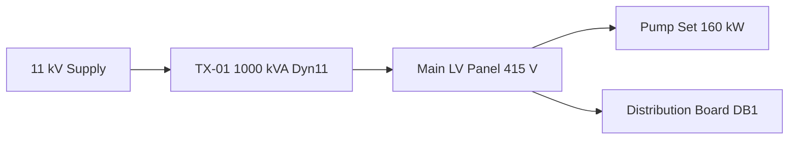

# Factory Acceptance Test Report TX-01

## Summary

All tests were witnessed at the manufacturer works. The unit passed every test in the approved schedule. No deviations were raised and no concessions were requested.

## Test conditions

Ambient temperature during testing was 22°C, measured at the test bay. Instrument calibration certificates were checked against the register before testing began.

## Results

| Test | Requirement | Measured | Result |
| --- | --- | --- | --- |
| Winding resistance, HV | Balanced within 2% | 1.8% spread | Pass |
| Winding resistance, LV | Balanced within 2% | 0.9% spread | Pass |
| Voltage ratio | 11 kV / 415 V | Within 0.3% | Pass |
| Vector group | Dyn11 | Dyn11 confirmed | Pass |
| Impedance at 75°C | 5.75% nominal | 5.71% | Pass |
| Insulation resistance | Above 1000 MΩ | 4700 MΩ | Pass |
| Temperature rise, oil | Below 60 K | 52 K | Pass |
| Temperature rise, winding | Below 65 K | 58 K | Pass |

## Impedance calculation

The measured impedance is referred to the rated temperature using the relationship below.

$$Z_{75} = \sqrt{R_{75}^2 + X^2}$$

The reactive component is treated as temperature independent. The resistive component measured 47 mΩ referred to the high-voltage side.

## Cable check

Outgoing circuits were verified against the design cross-sectional area. The 240 mm² four-core XLPE/SWA/PVC cable serving the main LV panel was confirmed as installed on site before the report was issued.

## Single line arrangement

## Outstanding items

- Site delivery inspection to be completed on arrival.
- Oil sample to be taken after energisation and before load is applied.
- Protection settings to be applied from the coordination study at commissioning.

## Sign off

Witnessed and accepted subject to the outstanding items listed above. The full-load loss figures are recorded in the manufacturer test certificate attached to this report.
